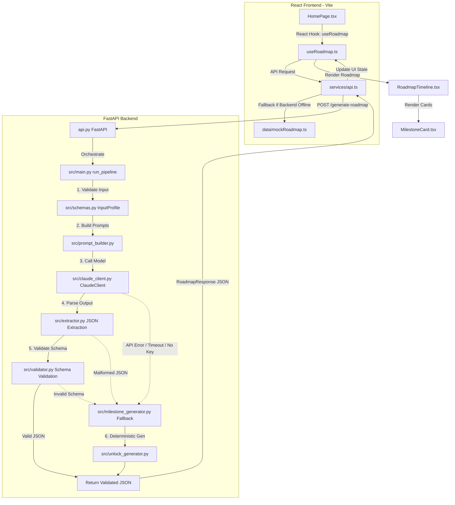

# AI Career Roadmap Generator

A production-grade, highly reliable AI-powered microservice and React application that accepts structured user profiles and generates deeply personalized, strictly validated 7-milestone career roadmaps.

This system guarantees structural determinism and high availability by pairing an **advanced AI orchestration pipeline** (with Anthropic Claude) with a **fail-safe deterministic fallback generator** and an **interactive, premium glassmorphism user interface**.

---

## 🏗️ System Architecture & Data Flow



---

## 🔄 End-to-End Data Flow

Here is a step-by-step trace of how data flows through the application:

1. **User Profile Input:**
   The user enters details in the interactive form on the React UI. Fields include `Name`, `ICP Type` (ICP-A: High Wage, ICP-B: Lower Wage), `Current Role`, `Target Role`, `Urgency`, `Location`, `Experience`, and current `Skills`.
2. **API Dispatch:**
   Submitting the form triggers the custom hook `useRoadmap.ts`, which calls the service `generateRoadmap(form)` in `api.ts`. A POST request is dispatched to the backend at `/generate-roadmap`.
3. **Backend Intake & Pydantic Parsing:**
   The FastAPI gateway whitelists the origin, parses the request, and validates it against the Pydantic model `InputProfile` in `src/schemas.py`. 
4. **AI Generation Stage:**
   - **Prompt Engineering:** The profile properties are mapped to deterministic, targeted instruction templates in `src/prompt_builder.py` designed to output formatted JSON.
   - **Model Request:** `ClaudeClient` in `src/claude_client.py` makes a low-temperature request to Anthropic Claude.
   - **JSON Extraction:** `src/extractor.py` extracts the JSON payload from the raw text by locating tags or parsing brackets.
   - **Strict Validation:** `src/validator.py` validates the parsed response against `RoadmapResponse` schema in `src/roadmap_schema.py`.
5. **Fail-safe Fallback:**
   If Claude is missing an API key, experiences rate limits, or returns malformed JSON that fails schema validation, the pipeline intercepts the error and calls `src/milestone_generator.py`. It deterministically generates a robust, fully personalized 7-milestone roadmap targeting the user's specific role using localized rules and custom unlock copy.
6. **Frontend Timeline Rendering:**
   The frontend receives the verified JSON containing exactly 7 milestones (`M01`–`M07`). The custom timeline components group these milestones into 4 logical phases and enforce beautiful blur levels on future steps.

---

## ⚡ How the Backend & APIs Work

The backend is built as a modular FastAPI microservice.

### HTTP Layer (`api.py`)
- Exposes `POST /generate-roadmap` receiving the user's career metrics.
- Exposes standard health endpoints (`GET /`, `GET /health`).
- Integrates full `CORS` middleware support to allow local and production frontend origins to fetch data.

### Orchestration Pipeline (`src/main.py`)
This is the core engine containing `run_pipeline(profile_data)`. It acts as a wrapper enforcing **100% success-guarantees** for the client:
```
[Validate Input] ➔ [Build Prompts] ➔ [Call Claude] ➔ [Extract JSON] ➔ [Validate Schema]
                                                                              │
               ┌─────────────────────── Fallback ─────────────────────────────┘
               ▼
[Run Local Milestone Generator] ➔ [Validate Schema] ➔ [Return Verified JSON]
```

### Prompt Engineering (`src/prompt_builder.py`)
System instructions strictly instruct the model on:
1. **Behavioral Goals:** Adapts difficulty, project targets, and salary expectations dynamically per user ICP.
2. **Formatting:** Restricts the model strictly to JSON with zero pre-amble or post-amble.
3. **Structured Constraints:** Enforces 7 milestones with codes `M01` to `M07`, and strict blur levels:
   - `M01`, `M02`: `blur_level = 0` (Fully Visible)
   - `M03`: `blur_level = 1` (Partially Blurred)
   - `M04`: `blur_level = 2` (Highly Blurred)
   - `M05`, `M06`, `M07`: `blur_level = 3` (Locked/Invisible)

---

## 💻 How the Frontend Talks to the Backend

The frontend is a React + TypeScript single-page application built on Vite and styled with tailwind CSS.

### Communication Interface (`frontend/src/services/api.ts`)
- **Direct Fetch:** Shoots standard HTTP `POST` requests to `${VITE_API_URL}/generate-roadmap` carrying the JSON representation of the input form.
- **Smart Connection Fallback:** If the backend microservice is offline, the fetch call fails. The service gracefully handles `TypeError: fetch failed` by logging a console warning and **automatically returning simulated mock data** after a small latency delay, keeping the UI fully interactive and demoable.

### State Controller Hook (`frontend/src/hooks/useRoadmap.ts`)
Encapsulates form input state, submission loading spinners, response validation errors, and clean resets:
```typescript
const { form, updateField, loading, roadmap, error, submit, reset } = useRoadmap();
```

---

## 📂 Mapping of Key Files & Responsibilities

### 🐍 Backend Directory (`/`)
| File Path | Purpose |
| :--- | :--- |
| **[api.py](file:///c:/Users/yashv/Desktop/REPOS/INTERN_CHLNG/api.py)** | FastAPI HTTP entrypoint exposing endpoints and CORS headers. |
| **[src/main.py](file:///c:/Users/yashv/Desktop/REPOS/INTERN_CHLNG/src/main.py)** | Central orchestration pipeline (`run_pipeline`) enforcing fallbacks. |
| **[src/schemas.py](file:///c:/Users/yashv/Desktop/REPOS/INTERN_CHLNG/src/schemas.py)** | Pydantic input validation model (`InputProfile`). |
| **[src/roadmap_schema.py](file:///c:/Users/yashv/Desktop/REPOS/INTERN_CHLNG/src/roadmap_schema.py)** | Strict schema for the output roadmap (`RoadmapResponse`). |
| **[src/prompt_builder.py](file:///c:/Users/yashv/Desktop/REPOS/INTERN_CHLNG/src/prompt_builder.py)** | Construct structured instructions tailored to user goals and ICP. |
| **[src/claude_client.py](file:///c:/Users/yashv/Desktop/REPOS/INTERN_CHLNG/src/claude_client.py)** | Robust client handling async API calls to Anthropic Claude. |
| **[src/extractor.py](file:///c:/Users/yashv/Desktop/REPOS/INTERN_CHLNG/src/extractor.py)** | Extracts valid JSON substrings from raw LLM responses. |
| **[src/validator.py](file:///c:/Users/yashv/Desktop/REPOS/INTERN_CHLNG/src/validator.py)** | Verifies extracted JSON conforms directly to the Pydantic roadmap schemas. |
| **[src/milestone_generator.py](file:///c:/Users/yashv/Desktop/REPOS/INTERN_CHLNG/src/milestone_generator.py)** | Local algorithm building high-fidelity roadmaps for fallback scenarios. |
| **[src/unlock_generator.py](file:///c:/Users/yashv/Desktop/REPOS/INTERN_CHLNG/src/unlock_generator.py)** | Generates unique unlock statements for local milestones. |

### ⚛️ Frontend Directory (`/frontend`)
| File Path | Purpose |
| :--- | :--- |
| **[frontend/src/services/api.ts](file:///c:/Users/yashv/Desktop/REPOS/INTERN_CHLNG/frontend/src/services/api.ts)** | Handles fetch calls to FastAPI, falling back gracefully to mock data if offline. |
| **[frontend/src/hooks/useRoadmap.ts](file:///c:/Users/yashv/Desktop/REPOS/INTERN_CHLNG/frontend/src/hooks/useRoadmap.ts)** | Custom hook managing state machine transitions of the React page. |
| **[frontend/src/pages/HomePage.tsx](file:///c:/Users/yashv/Desktop/REPOS/INTERN_CHLNG/frontend/src/pages/HomePage.tsx)** | High-fidelity landing page laying out forms, side panels, and output timelines. |
| **[frontend/src/components/roadmap/RoadmapTimeline.tsx](file:///c:/Users/yashv/Desktop/REPOS/INTERN_CHLNG/frontend/src/components/roadmap/RoadmapTimeline.tsx)** | Handles the timeline structure, grouping the 7 milestones into 4 logical phases. |
| **[frontend/src/components/roadmap/MilestoneCard.tsx](file:///c:/Users/yashv/Desktop/REPOS/INTERN_CHLNG/frontend/src/components/roadmap/MilestoneCard.tsx)** | Renders cards utilizing glassmorphic layouts, progressive blur filters, and locks. |

---

## 🚀 Setting Up & Running the Application

### 1️⃣ Setting Up the Backend
Ensure you have Python 3.10+ installed.

1. Navigate to the root directory and install dependencies:
   ```bash
   pip install -r requirements.txt
   ```
2. Set up your `.env` configuration file in the root directory:
   ```env
   ANTHROPIC_API_KEY=your_claude_api_key_here
   ```
3. Run the FastAPI development server:
   ```bash
   uvicorn api:app --reload --port 8000
   ```

### 2️⃣ Setting Up the Frontend
1. Navigate to the frontend directory:
   ```bash
   cd frontend
   ```
2. Install the frontend dependencies:
   ```bash
   npm install
   ```
3. Configure the `.env` file in the frontend folder:
   ```env
   VITE_API_URL=http://localhost:8000
   ```
4. Spin up the Vite development server:
   ```bash
   npm run dev
   ```
5. Open your browser and navigate to `http://localhost:5173`.
